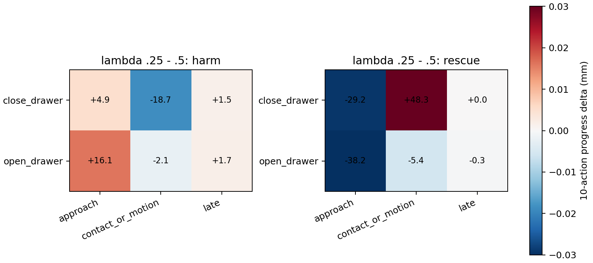

# Drawer Phase × Strength × Token Causal Audit

## Decision

**MIXED_PHASE_STRENGTH_AND_TOKEN_EVIDENCE**

## Design and integrity

- Same-state snapshots: 48/48; restore gate: PASS.
- Strength branches apply dynamic L11-Matched for 10 actions at lambda 0.5, 0.25, or 0.
- Token branches alter only the first decision's locked mask, then all return to dynamic L11-Matched lambda 0.5.
- Positive delta means more task-native physical progress than the corresponding baseline.

## Phase-specific strength result

| Task | Outcome | Phase | λ=.25 minus .5 (mm) | clean minus .5 (mm) |
|---|---|---|---:|---:|
| close_drawer | harm | approach | +4.93 | +26.74 |
| close_drawer | harm | contact_or_motion | -18.72 | -11.16 |
| close_drawer | harm | late | +1.50 | +5.54 |
| close_drawer | rescue | approach | -29.22 | -26.71 |
| close_drawer | rescue | contact_or_motion | +48.32 | +28.68 |
| close_drawer | rescue | late | +0.00 | +0.00 |
| open_drawer | harm | approach | +16.09 | -2.41 |
| open_drawer | harm | contact_or_motion | -2.13 | +0.72 |
| open_drawer | harm | late | +1.65 | +2.36 |
| open_drawer | rescue | approach | -38.18 | -22.12 |
| open_drawer | rescue | contact_or_motion | -5.39 | -54.81 |
| open_drawer | rescue | late | -0.30 | +4.27 |

## Mechanism boundary

The branch outcomes are causal for the restored state and next 10 actions. They identify whether attenuation or one token subset changes immediate physical progress; they do not by themselves prove a full rollout would flip success.

## Files

- `FINAL_RESULTS.json`: decision and machine-readable evidence.
- `strength_rows.csv`: every state × lambda branch.
- `token_rows.csv`: every state × removed sector.
