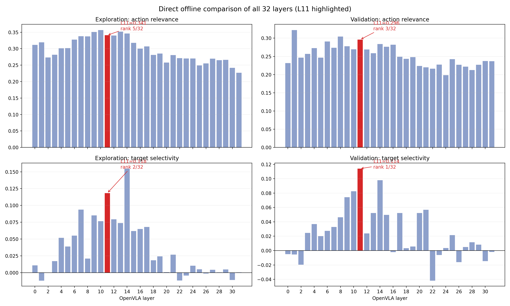

# Direct L0-L31 comparison

This report compares all 32 single layers with the same states and the same matched token count. Budget scaling is not part of this comparison.

## L11 ranks

| Metric | Exploration | Validation |
|---|---:|---:|
| Action relevance | 0.3410 (rank 5/32) | 0.2961 (rank 3/32) |
| Target selectivity | 0.1182 (rank 2/32) | 0.1141 (rank 1/32) |
| Mask target selectivity | 0.1546 (rank 1/32) | 0.1392 (rank 1/32) |

## Honest result

L11 is one of the strongest balanced layers: it is near the top for action relevance and at the top for sensitivity to a real target change. It is not the numerical winner of every metric, so this offline scan does not prove that L11 is the unique best layer. L9 and L14 remain the closest alternatives; only closed-loop evaluation can resolve success rate.

