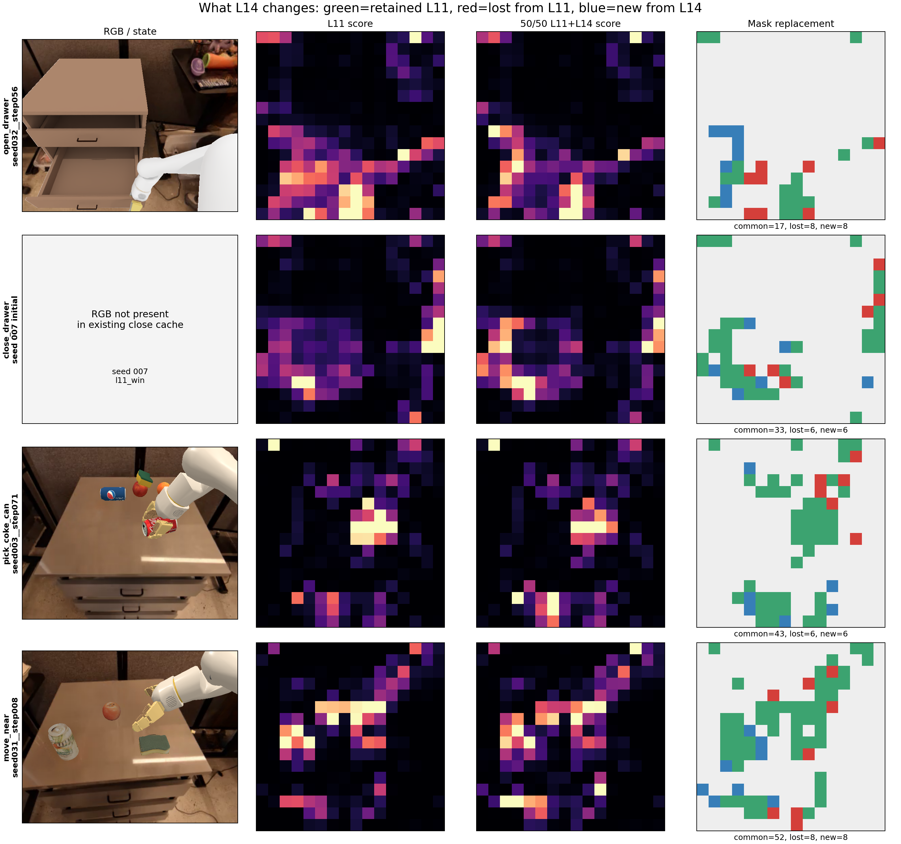
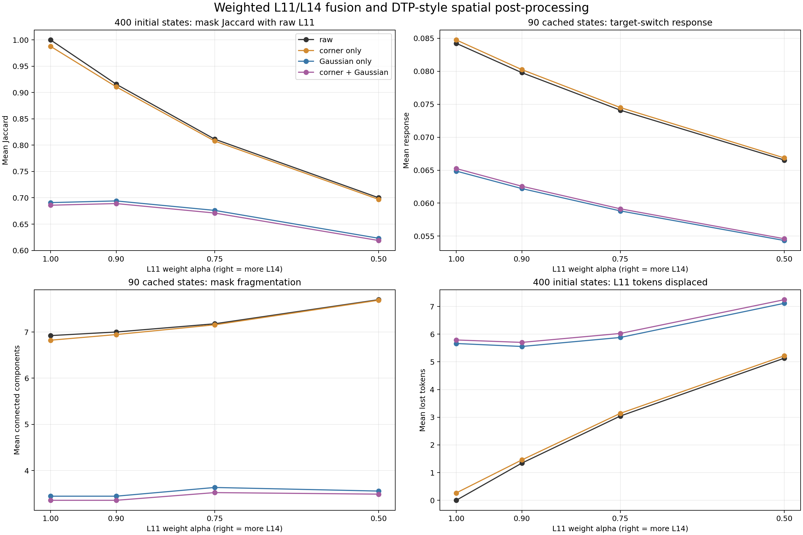
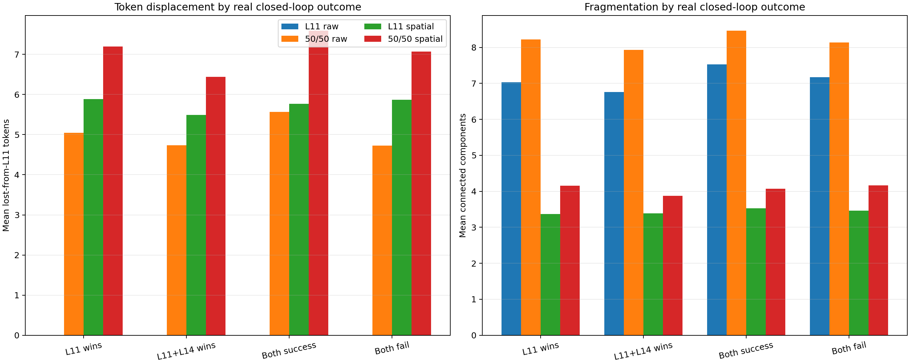

# L11 + L14 ranking pollution vs spatial post-processing

生成日期：2026-09-14  
本轮只做离线重建，没有启动新闭环或模型 forward。

## 数据与一致性

- 90 个完整 same-state 缓存：open/pick/move 各 30 states，均有 L0–L31 attention、RGB、matched mask；其中 9 states 有 target-switch attention。
- 400 个共同初始状态：open/close/pick/move 各 100 seeds。L11 与 L11+L14 的 summary/arrays 均完整。
- 400/400 seed 的两臂初始 matched token 数一致；800/800 保存 mask 均精确等于对应 score map 的稳定 Top-m。
- 初始状态的 L14 由 `A14 = 2 * A(L11+L14) - A11` 恢复，仅用于同一初始 state 的离线加权扫描。
- 空间处理采用仓库已有 calibration：四角 score 置零；Gaussian `sigma=0.65`、reflect padding、truncate=4。

## 真实闭环输赢分组

| Group | Episodes |
|---|---:|
| L11 success / L11+L14 fail | 71 |
| L11 fail / L11+L14 success | 41 |
| Both success | 167 |
| Both fail | 121 |

## 核心结果

### 1. L14 权重增加时，L11 ranking 是否持续被替换

| L11 weight α | Jaccard with L11 | L11 retention | Lost tokens | Target response | Components |
|---:|---:|---:|---:|---:|---:|
| 1.00 | 1.0000 | 1.0000 | 0.00 | 0.08423 | 6.92 |
| 0.90 | 0.9159 | 0.9546 | 1.34 | 0.07978 | 7.00 |
| 0.75 | 0.8114 | 0.8925 | 3.04 | 0.07409 | 7.18 |
| 0.50 | 0.7000 | 0.8162 | 5.13 | 0.06653 | 7.70 |

Raw target response 随 L14 权重增加是否单调下降：**是**。

该趋势在三个有 target-control 的任务上分别成立：

| Task | α=1.0 | α=.9 | α=.75 | α=.5 |
|---|---:|---:|---:|---:|
| open_drawer | 0.03873 | 0.03503 | 0.03012 | 0.02325 |
| pick_coke_can | 0.17195 | 0.16730 | 0.16146 | 0.15385 |
| move_near | 0.04202 | 0.03701 | 0.03070 | 0.02250 |

从 α=1.0 到 α=.5，aggregate target response 下降 **21.0%**，初始 mask 平均挤掉 **5.13** 个 L11 token。

### 2. DTP-style spatial 是否能救 50/50 融合

| Spatial | 50/50 Jaccard | Lost tokens | Target response | Components | Isolated ratio | Largest component |
|---|---:|---:|---:|---:|---:|---:|
| raw | 0.7000 | 5.13 | 0.06653 | 7.70 | 0.1448 | 0.5629 |
| corners | 0.6970 | 5.22 | 0.06685 | 7.69 | 0.1466 | 0.5659 |
| gaussian | 0.6231 | 7.12 | 0.05433 | 3.56 | 0.0354 | 0.7646 |
| both | 0.6188 | 7.25 | 0.05460 | 3.49 | 0.0354 | 0.7677 |

按 target response，50/50 融合中最佳 spatial mode 是 **corners**。是否值得进入小闭环，必须同时检查它是否只是通过大幅改变 L11 mask 换来更平滑外观。

Gaussian 确实把 components 从 **7.70** 降到 **3.56**（减少 **53.8%**），但 target response 同时从 **0.06653** 降到 **0.05433**（再下降 **18.3%**），相对 raw L11 平均挤掉的 token 也从 **5.13** 增加到 **7.12**。它改善的是空间连通性，不是目标相关 ranking。

### 3. Spatial 对纯 L11 的影响

| Spatial | Jaccard with raw L11 | Lost tokens | Target response | Components |
|---|---:|---:|---:|---:|
| raw | 1.0000 | 0.00 | 0.08423 | 6.92 |
| corners | 0.9878 | 0.27 | 0.08475 | 6.82 |
| gaussian | 0.6909 | 5.66 | 0.06486 | 3.44 |
| both | 0.6859 | 5.79 | 0.06525 | 3.36 |

Corner-only 对纯 L11 几乎是恒等变换：400 个初始状态平均只替换 **0.27** 个 token，target response 仅从 **0.08423** 变为 **0.08475**。

## 当前判定

本轮证据更支持：

> **L14 主要在持续扰动 L11 的 ranking；缺失 Gaussian/corner 不是 50/50 组合失败的主要原因。**

理由：L14 权重增加时，三个任务的 target response 均单调下降；50/50 仅保留 **81.6%** 的 L11 token；Gaussian 虽让 mask 更连通，却进一步降低 target response并替换更多 L11 token；corner-only 的影响又太小。另一方面，L11-win 与 sparse-win 组的替换数量很接近，说明真正重要的是被替换 token 的位置和语义，而不是数量本身。

**Go/No-Go：当前对 weighted L11+L14 + Gaussian/corner 的 25-seed 闭环判定为 No-Go。** 离线没有出现能够同时保住 L11 target response、保留 L11 ranking、并利用空间正则化改善组合的候选。唯一勉强可测的是 `L11 + corner-only`，但它与 raw L11 几乎相同，预期效应很小。

## 图

## 解释边界

- 90-state target response 只有 9 个手工 target-switch controls，因此它是机制指标，不是成功率替代品。
- 400-state outcome grouping 使用共同初始 state，避免了两条闭环轨迹在第一步后状态分叉的问题。
- close_drawer 没有现成 RGB full-layer cache，因此 replacement 图展示其初始 16×16 score/mask，而非 RGB overlay。
- Gaussian/corner 的具体实现是本仓库的 paper-based calibrated implementation；原论文没有完全指定所有空间处理细节。
- 本轮不根据单一指标自动启动闭环。是否跑 25-seed pilot 应结合 target response、L11 retention、fragmentation 和 outcome-conditioned replacement 一起判断。

## 输出文件

- `CACHED_90_STATE_ROWS.csv`
- `INITIAL_400_STATE_ROWS.csv`
- `CACHED_90_AGGREGATE.csv`
- `INITIAL_400_AGGREGATE.csv`
- `INITIAL_400_OUTCOME_AGGREGATE.csv`
- `RESULTS.json`
- `figure_token_replacement.png`
- `figure_weight_spatial_scan.png`
- `figure_outcome_conditioned.png`
