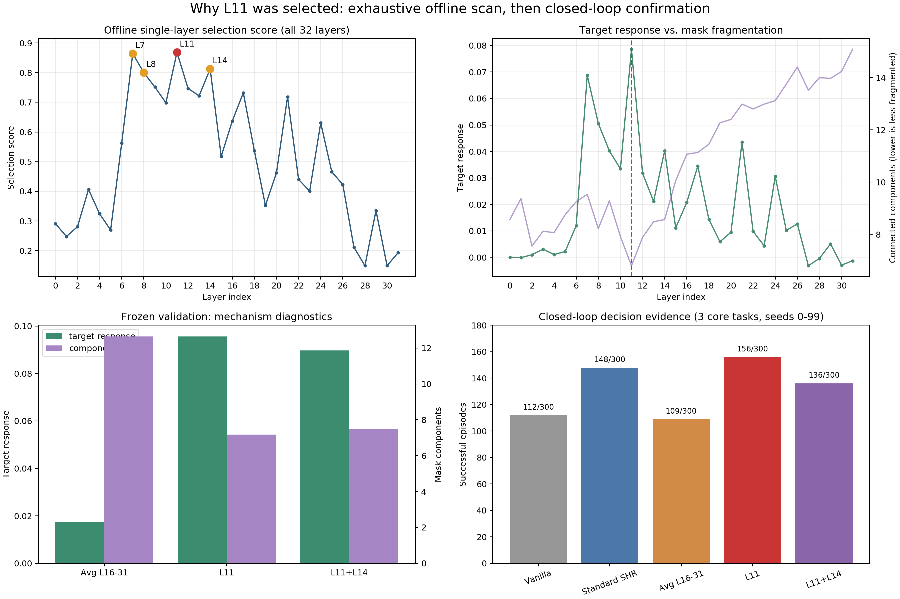
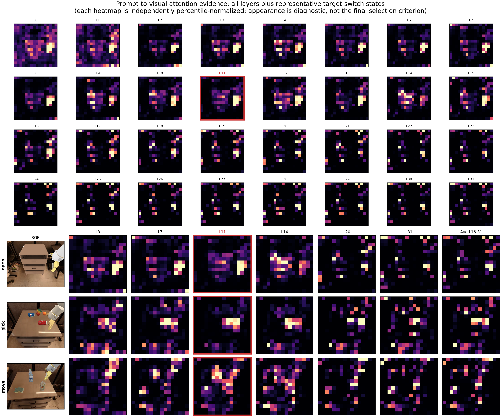
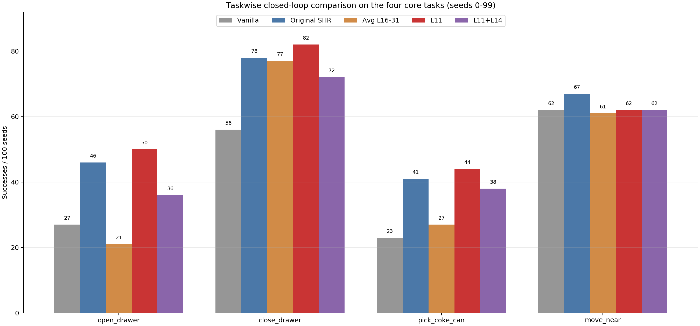
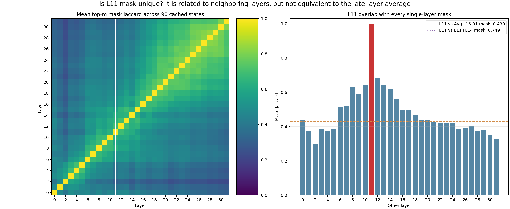

# OpenVLA Prompt-Attention L11 选层审计

生成日期：2026-09-14  
审计范围：当前代码仓库、`artifacts/`、周报、冻结配置、离线缓存和闭环 episode summary。所有图表均由现存数据重建；未找到的数据明确标注为未找到。

## 一句话结论

L11 **不是先看一张热力图拍脑袋决定的，也不是把 L0–L31 全部逐层跑了闭环后取最大值**。实际链条是：先用 **L16–L31 简单平均**做 Prompt-v1，但三任务闭环只有 **109/300**，弱于 Standard SHR 的 **148/300**；随后从缓存的 90 个 state 中对 **L0–L31 全部做离线逐层诊断**，按“目标切换响应 + mask 响应 + 正确方向比例 + 同义指令稳定性”冻结出 L11、L7、L14、L8，并把 **L11**与离线分数最高的组合 **L11+L14**送入闭环；最终 L11 得到 **156/300**，高于 L11+L14 的 **136/300**和 Avg L16–31 的 **109/300**，因此固定为 L11。

换句话说：**attention/目标切换诊断负责提出候选，matched closed-loop success 负责最终定案。** 热力图只是机制证据，正式报告明确写道最终结论不由“看起来更好”决定。

## 证据链

### 1. 起点：后半层平均 Prompt-v1 先失败

- 配置：`artifacts/prompt_attn_shr_v1/CONFIG_LOCK.json`。使用 L16–L31 等权平均、完整 instruction query、与 SHR 相同的 selected-token 数量、相同 harmonic reconstruction、`lambda=0.5`。
- 代码实现：`research/semantic_token_cd/prompt_attn_shr_policy.py:430`提取全部 32 层 attention；`research/semantic_token_cd/prompt_attn_shr_policy.py:482`对配置指定层做算术平均。
- 三任务闭环：Vanilla **112/300**，Standard SHR **148/300**，Prompt-v1 **109/300**，Random-SHR **125/300**。Prompt-v1 相对 SHR 为 Rescue 25、Harm 64、净变化 **-39**。
- 失败诊断：`artifacts/prompt_attn_shr_failure_diagnosis_v1/AGGREGATE_DIAGNOSTICS.json`显示 Avg L16–31 mask 平均 **12.978**个连通分量、孤立 token 比例 **0.256**、最大连通块比例 **0.283**；Standard SHR 分别为 **3.056 / 0.031 / 0.753**。两者动作 residual cosine 只有 **0.297**。
- 当时周报原文：**“Attention 不是不能用，而是把很多层直接平均，会把少数有用层的任务信号冲淡。”** 来源：`reports/weekly_report_2026-09-05_09-11.md:151`。

### 2. 逐层离线初筛：L0–L31 都测了，但测的是缓存 state，不是闭环

- `research/semantic_token_cd/analyze_prompt_attn_layers.py:20`定义 `LAYERS=tuple(range(32))`，确实逐一评估了全部 32 层。
- 数据划分：`artifacts/prompt_attn_layer_selection_v1/SPLIT_AND_CONTROLS.json`固定 30 个 episode、每个 3 个 state，共 90 states；20 episodes/60 states 用于 exploration，10 episodes/30 states 完全留作 frozen validation。
- 评分规则：`research/semantic_token_cd/analyze_prompt_attn_layers.py:161`：55% target attention response percentile、20% target-mask response、15% correct-both fraction、10% synonym top-m Jaccard；且至少两个任务 target response 为正。
- L11 是符合资格的单层第一名：selection score **0.868750**；target response **0.078585**；target-mask response **0.089506**；同义指令 mask Jaccard **0.895**。
- 冻结出的单层候选顺序是 **L11、L7、L14、L8**，见 `artifacts/prompt_attn_layer_selection_v1/CANDIDATES_LOCK.json`。
- 邻近层并非完全没信号：L10 score **0.698**，L12 score **0.747**；但都低于 L11 的 **0.869**。L14 是 shortlist 第三，而不是单层冠军。

### 3. 多层组合也测了：离线组合甚至一度胜过 L11

- `research/semantic_token_cd/analyze_prompt_attn_layers.py:168`先取前四个单层候选，然后评估它们的全部 6 个两两组合：L11+L7、L11+L14、L11+L8、L7+L14、L7+L8、L14+L8。
- exploration 上 L11+L14 score 为 **0.888281**，实际上高于 L11 的 **0.868750**，所以它被诚实地选为 `prompt_sparse` 候选。
- 没有找到 L11+L12 的正式实验；也没有找到 L7、L8、L14 单独跑 100-seed 闭环的结果。不能把“全 32 层离线扫描”写成“全 32 层闭环扫描”。

### 4. 冻结验证：L11/L11+L14 都能响应目标切换，晚层平均明显被稀释

- 候选与评分规则先写入 `CANDIDATES_LOCK.json`，再读取 held-out validation。文件时间也符合协议：候选锁 2026-09-06 09:30:52，validation 结果 09:31:09。
- L11 validation：target response **0.0955**，正确响应比例 **100%**，mask components **7.17**，最大连通块 **0.571**。
- L11+L14：target response **0.0897**，正确响应比例 **100%**，components **7.47**。
- Avg L16–31：target response 仅 **0.0173**，正确响应比例 **66.7%**，components **12.63**，最大连通块仅 **0.290**。
- 因此 validation 中 L11 的 target response 约为 Avg L16–31 的 **5.5 倍**，且 mask 更集中。这里支持“平均稀释信号”，但还不是最终定案。

### 5. 最终定案：matched closed-loop 明确选择 L11，而不是离线分更高的 L11+L14

- 闭环配置：`artifacts/prompt_attn_layer_selection_v1/closed_loop/CONFIG_LOCK.json`；L11 与 L11+L14 均保持 `lambda=0.5`、相同 matched token coverage、相同重建方式和 canonical snapshot。
- 三任务 seeds 0–99：Avg L16–31 **109/300**，L11 **156/300**，L11+L14 **136/300**。L11 比平均多 **47** 次成功，比组合多 **20** 次成功。
- 配对结果见 `artifacts/prompt_attn_layer_selection_v1/closed_loop/report.md`：L11 vs Avg L16–31 为 Rescue 76 / Harm 29 / 净 **+47**；L11+L14 vs Avg 为 Rescue 61 / Harm 34 / 净 **+27**；L11 vs Standard SHR 为 Rescue 51 / Harm 43 / 净 **+8**。L11+L14 vs SHR 反而净 **-12**。
- 这一步推翻了“离线 selection score 最高就直接采用 L11+L14”的可能性。最终选择 L11 的最关键证据就是 **同 seed matched 闭环成功率与 Rescue/Harm 配对结果**。

### 6. 扩展到 9 任务：L11 的优势不是只存在于三任务筛选

- 周报统一对齐 seeds 0–99、900/900 初始 state/RGB hash 一致：Vanilla **173/900**，原始 SHR **235/900**，L11 **243/900**。
- L11 vs Vanilla：Rescue 99 / Harm 29 / 净 **+70**；L11 vs 原始 SHR：Rescue 65 / Harm 57 / 净 **+8**。
- 主要提升来自 open、close、pick；move_near 比原始 SHR 少 5，其余低成功率任务判别力有限。因此“L11 最好”是当时这套 9-task aggregate 下的选择，不代表每个任务都由 L11 单独支配。
- 当前 raw summaries 还能恢复 Avg L16–31、L11、L11+L14 的 9-task totals，分别为 **188/900、243/900、215/900**。其中 L11 仍最高。

## L11 是否“特殊”

对缓存的 90 个 state，按照每个 state 的 matched token 数量重建所有单层 top-m mask。L11 与 Avg L16–31 mask 的平均 Jaccard 为 **0.430**，与 L11+L14 为 **0.749**。这说明 L11 不是和所有层完全无关的孤岛，但它也绝不等价于晚层平均；加入 L14 会实质改变选区，并在闭环中损失 20/300 成功。

## 明确回答六个问题

1. **是不是做过逐层实验？** 是，但准确说是 L0–L31 的离线 state-level attention/mask 诊断；没有证据表明 32 个单层都各跑过完整闭环。
2. **是不是做过多层平均 vs 单层？** 是。正式比较了 Avg L16–31、L11，以及 L11+L14；Prompt-v1 的平均策略先在闭环失败，L11 后来显著胜出。
3. **是不是做过 L11+其他层？** 是。离线做过前四候选的 6 个两层组合；正式闭环做过 L11+L14。没有找到 L11+L12 闭环证据。
4. **最终选 L11 最关键证据是什么？** 三任务 100 seeds 的 matched closed-loop：L11 156/300，L11+L14 136/300，Avg L16–31 109/300；同时有同 seed Rescue/Harm 配对支持。
5. **候选来自可视化还是闭环直接选优？** 两者共同决定，但职责不同：目标切换/attention/mask 诊断提出 L11 候选，闭环成功率最终定案。不是只看热力图。
6. **有没有“平均多层稀释信号”的证据？** 有。Avg L16–31 的 validation target response 只有 0.0173，L11 为 0.0955；平均 mask 更碎（12.63 vs 7.17 components），闭环更差（109/300 vs 156/300）。加入 L14 同样从 156/300 降到 136/300。不过应写成“在已测试的简单等权平均中出现稀释”，不能推广为所有多层融合必然失败。

## 重要边界与缺失数据

- 没有找到“每个 L0–L31 单层各 100 seeds 闭环”的证据；全层曲线是离线评分曲线。
- 没有找到 all-layer average（L0–L31）正式结果；找到的是 later-layer average（L16–L31）。
- 没有找到 L11+L12 正式结果。
- L7/L8/L14 是离线 shortlist，但未找到它们的独立 100-seed 闭环结果。
- first-3-task 筛选报告里的 `Standard SHR` 是当轮重跑参考（open 47、pick 41、move 60）；9-task 周报里的“原始 SHR”来自此前 canonical 9×300 数据切片（open 46、pick 41、move 67）。本报告不混用这两套基线：三任务定案引用当轮 matched report，四任务/九任务图引用周报 canonical baseline。
- attention 热力图逐图独立归一化，只能解释空间结构，不能用于跨层比较绝对 attention mass。

## 可复现文件

- 汇总表：`EVIDENCE_TABLE.csv`
- 作图/重建脚本：`research/semantic_token_cd/build_l11_layer_selection_audit.py`
- 原始逐层表：`artifacts/prompt_attn_layer_selection_v1/exploration_per_layer.csv`
- 原始组合表：`artifacts/prompt_attn_layer_selection_v1/exploration_candidate_pairs.csv`
- 候选冻结：`artifacts/prompt_attn_layer_selection_v1/CANDIDATES_LOCK.json`
- 冻结验证：`artifacts/prompt_attn_layer_selection_v1/VALIDATION_LAYER_RESULTS.json`
- 闭环报告：`artifacts/prompt_attn_layer_selection_v1/closed_loop/report.md`
- 周报总结：`reports/weekly_report_2026-09-05_09-11.md`
