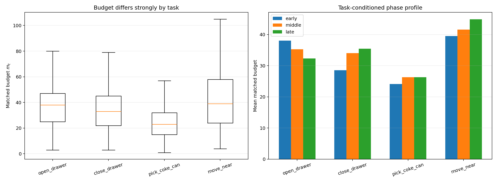
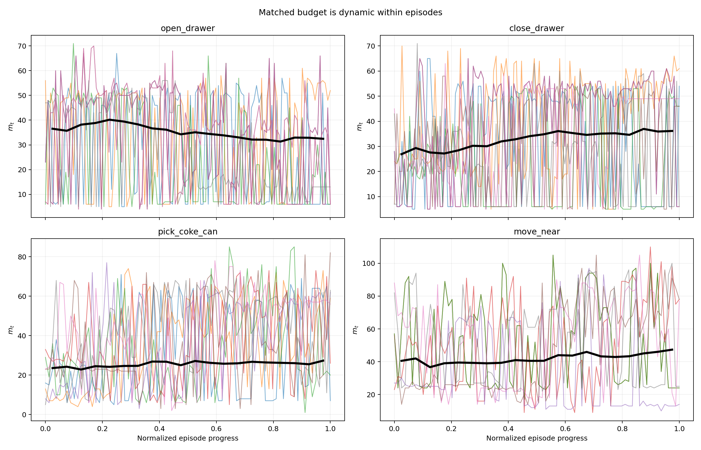
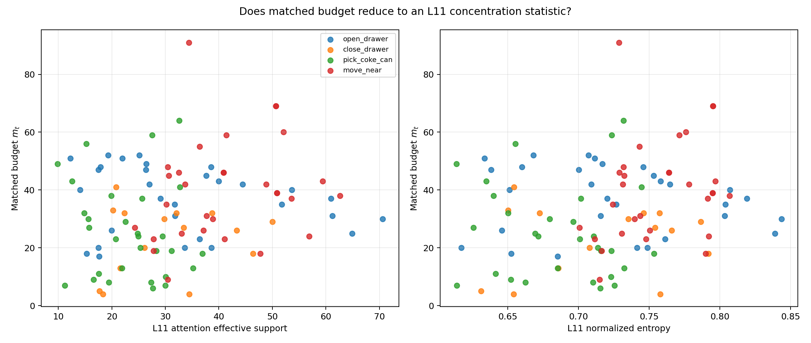
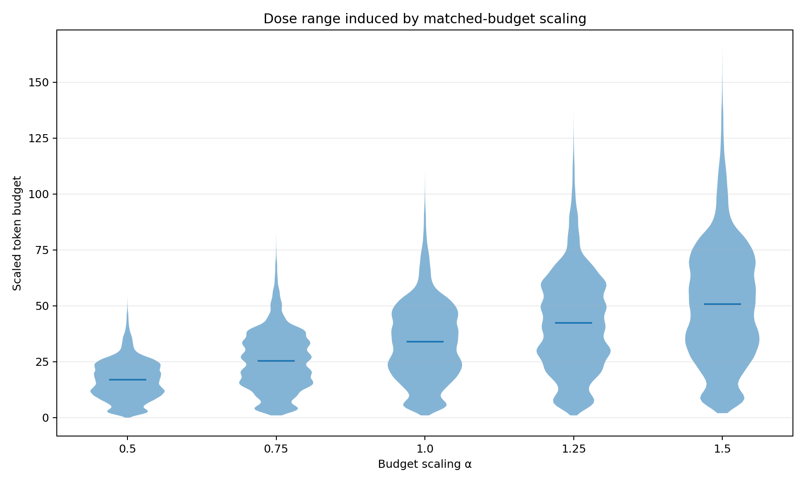

# What does the L11 matched budget encode?

生成日期：2026-09-14。该报告完全离线；未运行新 OpenVLA forward，未控制环境。

## 数据

- 400 条四任务 Matched episode，合计 38600 个 control steps（seeds 100–199）。
- 105 个缓存 full-layer same-state，用于恢复 L11 attention entropy/effective support。

## 当前结论

1. Matched 的整体预算均值为 **33.86**，但分布很宽：P10=12、median=33、P90=55、范围=1–110。因此均值约34不能代表逐状态剂量。
2. task 单独解释预算方差的 **9.6%**；phase 单独解释 **0.2%**；task+phase 仅解释 **11.4%**，仍有 **88.6%** 是同任务同阶段内变化。
3. episode 内预算并不固定：平均 episode 内标准差 **13.93**，平均范围 **57.33**；若整条 episode 固定为首步预算，逐步 MAE 为 **15.63 tokens**。
4. 在105个 attention state 上，m_t 与 L11 effective support 的 Spearman 相关仅 **+0.168**，与 entropy 为 **+0.184**。Matched 不能简单等价为一个 L11 concentration cutoff。
5. m_t 与实际 feature corruption 的 Spearman 相关为 **+0.953**，与 logit residual 为 **+0.518**，与改变动作维数为 **+0.053**。这验证 m_t 确实控制了反事实干预剂量，但 token 数并不完全决定最终动作影响。

## 对闭环实验的含义

- **Global Shuffle**：检验整体数量分布是否足够。
- **Within-task Shuffle**：检验 task-level 分布是否足够；由于 task+phase 后仍有大量剩余方差，这是最关键的 state-alignment 对照。
- **Episode-fixed**：现有轨迹显示它会产生明显逐步预算误差，可检验 phase/state 动态是否必要。
- **Scaling**：α={0.5,0.75,1.0,1.25,1.5} 保留状态排序但改变绝对 corruption dose；用于判断 α=1 是否接近峰值。

## 冻结闭环协议

1. 使用与 count/top-p 完全相同的四任务 canonical seeds 100–199、L11 ranking、λ=0.5、harmonic reconstruction。
2. Matched α=1.0 直接复用已有 400 episodes；新跑 Global-Shuffle、Within-task-Shuffle、Episode-fixed 与 α=0.5/0.75/1.25/1.5，共 7×400=2800 条新 episode。
3. Shuffle 映射必须在运行前以 JSON 冻结；Global Shuffle 跨四任务同 normalized progress bin 置换，Within-task Shuffle 在 task+progress bin 内置换，避免拿不存在的未来轨迹长度直接对齐。
4. 主指标为 paired success/McNemar；辅助指标为逐步 budget deviation、feature perturbation、logit residual 和 guided action change。

## 尚未回答

- 现有 trace 只保存 union mask 和 group IDs，没有保存完整 KMeans labels，因此无法离线恢复 source/target 各自 cluster size；需要未来 replay 时补充日志。
- 本报告说明 matched budget 包含 task 与 state/phase 变化，也控制 corruption dose；但只有 shuffle/scaling 闭环才能证明这些变化是否造成成功率优势。

## 图

