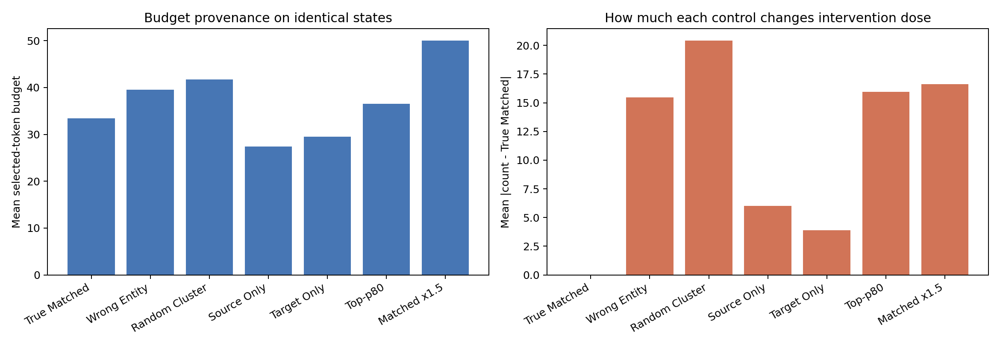

# L11 Matched Budget Provenance: Offline Audit

同一60个保存状态；不跑环境闭环，不使用动作指标。所有 arm 使用同一条 L11 排名，只改变预算来源。

## 技术审计

- 60/60 Matched 数量逐状态精确复现。
- 60/60 L11 attention 与历史缓存 bit-exact（最大差异 0）。
- 所有对照都选择 L11 Top-m；因此 mask 差异只来自 m。

## 汇总

| Budget source | Mean count | Mean abs diff vs true | Same-count rate | Spearman vs true | Count→corruption ρ | Mean corruption |
|---|---:|---:|---:|---:|---:|---:|
| True Matched | 33.42 | 0.00 | 100.0% | 1.000 | 0.946 | 0.3016 |
| Wrong Entity | 39.50 | 15.48 | 11.7% | 0.219 | 0.915 | 0.3389 |
| Random Cluster | 41.68 | 20.43 | 6.7% | 0.076 | 0.938 | 0.3400 |
| Source Only | 27.42 | 6.00 | 75.0% | 0.675 | 0.968 | 0.2676 |
| Target Only | 29.53 | 3.88 | 75.0% | 0.871 | 0.955 | 0.2804 |
| Top-p80 | 36.48 | 15.97 | 0.0% | 0.031 | 0.895 | 0.3254 |
| Matched x1.5 | 50.05 | 16.63 | 0.0% | 1.000 | 0.966 | 0.3763 |

## 边界

本报告只回答不同预算来源在同一状态上产生什么数量和 feature-corruption 差异。
它不使用成功结果，因此不能单独证明哪一种预算提高闭环成功率；该因果问题必须由冻结闭环对照回答。

