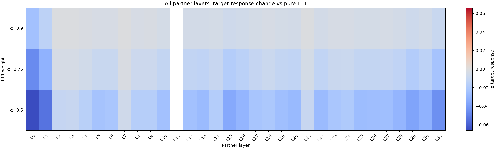
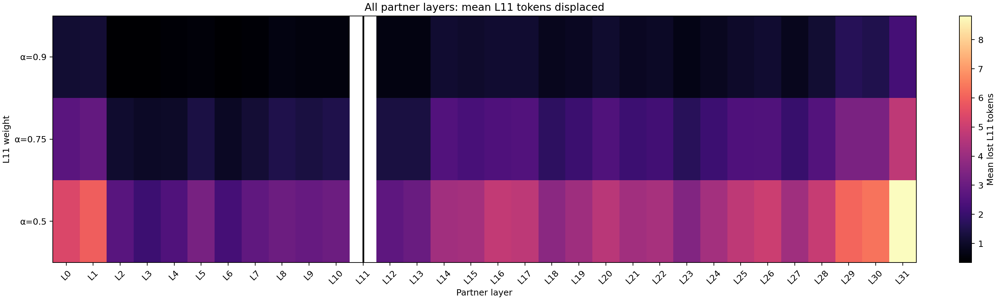
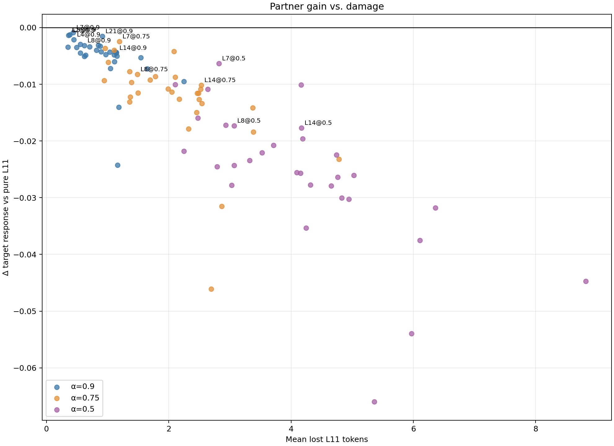
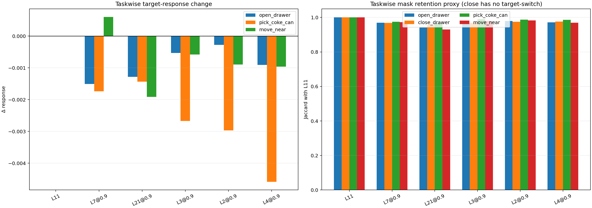
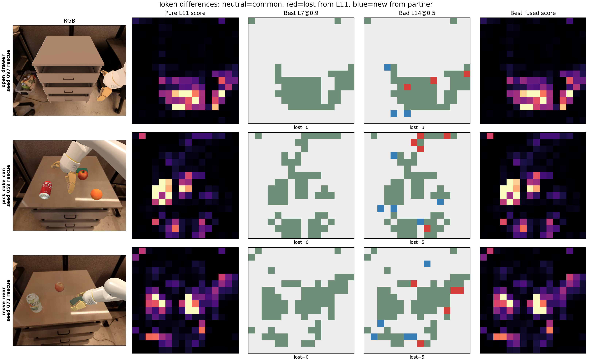

# L11 partner-layer systematic scan

生成日期：2026-09-14  
本轮未运行新 OpenVLA forward，也未启动闭环。扫描范围为 31 个 partner layers × 3 个 L11 权重，共 93 个组合。

## 数据

- 105 个 full-layer same-state：open/pick/move 各30，close 15。
- 所有 state 均包含 `[32,256]` Prompt→Visual attention、RGB 与 Standard-SHR matched `m_t`。
- 9 个 state 具有 target-switch control；close 当前没有 target-switch，因此 close 只报告 mask/ranking proxy。
- Rescue/Harm 定义为 L11 相对 canonical Vanilla：Rescue=`Vanilla fail, L11 success`，Harm=`Vanilla success, L11 fail`。

## 结论

1. **有没有 partner 明确比纯 L11 更好？** 严格候选数量：**0**；宽松候选数量：**1**。
2. **最直接的结果**：93 个组合中，整体 target response 正增益为 **0/93**；即当前扫描里没有任何组合超过纯 L11。
3. **最高互补排名**：L7，α=0.9；Δ target response=-0.000880，Jaccard=0.9717，lost=0.44。它更接近“几乎不改变 L11”，而不是提供了可测的互补增益。
4. **是否值得 25-seed pilot？** **否**。规则是只有至少一个组合同时通过 target、retention、task consistency 与 fragmentation 的严格门槛才启动。

## 最佳组合逐任务诊断

| Task | Δ target | Jaccard | Lost L11 tokens | Δ components |
|---|---:|---:|---:|---:|
| open_drawer | -0.001506 | 0.9693 | 0.53 | +0.17 |
| close_drawer | N/A | 0.9679 | 0.40 | -0.13 |
| pick_coke_can | -0.001735 | 0.9749 | 0.33 | -0.07 |
| move_near | +0.000600 | 0.9729 | 0.47 | +0.00 |

## Top 10 complement ranking

Composite 仅用于排序：45% target-gain percentile + 25% Jaccard + 15% retained fraction + 15% task consistency − fragmentation penalty。

| Rank | Partner | α | Δ target | Jaccard | Lost | Δ components | Task nonharm | Strict | Relaxed |
|---:|---:|---:|---:|---:|---:|---:|---:|---:|---:|
| 1 | L7 | 0.90 | -0.000880 | 0.9717 | 0.44 | +0.01 | 1.00 | 0 | 1 |
| 2 | L21 | 0.90 | -0.001544 | 0.9480 | 0.91 | +0.34 | 1.00 | 0 | 0 |
| 3 | L3 | 0.90 | -0.001261 | 0.9778 | 0.38 | -0.01 | 0.67 | 0 | 0 |
| 4 | L2 | 0.90 | -0.001380 | 0.9817 | 0.36 | -0.06 | 0.67 | 0 | 0 |
| 5 | L4 | 0.90 | -0.002151 | 0.9755 | 0.45 | +0.00 | 0.67 | 0 | 0 |
| 6 | L18 | 0.90 | -0.003138 | 0.9510 | 0.85 | +0.26 | 0.67 | 0 | 0 |
| 7 | L6 | 0.90 | -0.003461 | 0.9773 | 0.35 | -0.04 | 0.67 | 0 | 0 |
| 8 | L5 | 0.90 | -0.003509 | 0.9733 | 0.50 | +0.05 | 0.67 | 0 | 0 |
| 9 | L3 | 0.75 | -0.003664 | 0.9490 | 0.96 | -0.17 | 0.67 | 0 | 0 |
| 10 | L27 | 0.90 | -0.003971 | 0.9532 | 0.82 | +0.31 | 0.67 | 0 | 0 |

## 特别层

| Layer | Best α | Δ target | Jaccard | Lost | Composite |
|---:|---:|---:|---:|---:|---:|
| L7 | 0.90 | -0.000880 | 0.9717 | 0.44 | 0.9906 |
| L8 | 0.90 | -0.003195 | 0.9648 | 0.62 | 0.8498 |
| L14 | 0.90 | -0.004452 | 0.9292 | 1.14 | 0.7244 |

## 最容易污染 L11 的组合

| Partner | α | Δ target | Jaccard | Lost |
|---:|---:|---:|---:|---:|
| L0 | 0.50 | -0.065996 | 0.7294 | 5.36 |
| L1 | 0.50 | -0.053986 | 0.7077 | 5.97 |
| L0 | 0.75 | -0.046122 | 0.8634 | 2.70 |
| L31 | 0.50 | -0.044727 | 0.5494 | 8.82 |
| L29 | 0.50 | -0.037546 | 0.6485 | 6.10 |

## Rescue/Harm 检查

最佳排名组合在 L11 Rescue 组中的平均 lost/Jaccard：**0.51 / 0.9708**。  
在 L11 Harm 组中：**0.33 / 0.9730**。  
这些是 seed-level outcome 条件下的 same-state mask proxy；不是候选真实闭环收益。

## 图

## 边界

- target response 仅来自9个手工 target-switch controls，必须作为候选筛选信号而非成功率替代品。
- close 没有 target-switch，不能声称某个组合提升了 close target response。
- Groupwise 只判断 partner 在既有 L11 Rescue/Harm state 上改变了什么，不能证明它会把 Harm 修复为成功。
- 没有通过严格门槛时，不为了多层融合形式强行启动闭环。
