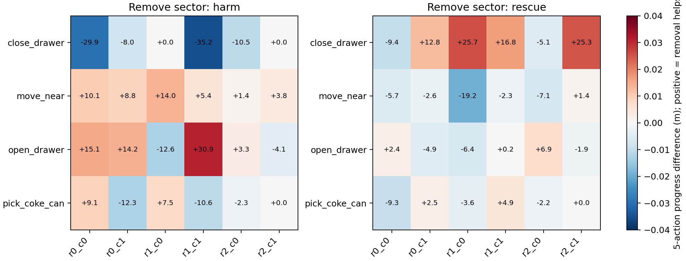

# L11 Token-group Causal Audit

## Decision

**NO_STABLE_SPATIAL_FILTER_RULE**

## Integrity

- Cases: 60/60; spatial ablations: 290.
- Snapshot / RGB tolerance / source-mask gate: PASS.
- Every comparison restores the same simulator state, changes only one spatial subset of the first L11 mask, then uses the same L11-Matched continuation for five actions.

## Pooled causal effect

- rescue: mean leave-one-group-out minus full-L11 progress = +0.00166 m; improved >2 mm 57/174, worsened >2 mm 66/174.
- harm: mean leave-one-group-out minus full-L11 progress = +0.00140 m; improved >2 mm 49/116, worsened >2 mm 33/116.

## Spatial sectors

| Sector | Harm mean Δ | Rescue mean Δ | Harm +/- | Rescue +/- |
|---|---:|---:|---:|---:|
| fallback_spatial_a | — | +0.01576 | +0 | +1 |
| fallback_spatial_b | — | +0.01576 | +0 | +1 |
| r0_c0 | +0.00835 | -0.00446 | +7 | -7 |
| r0_c1 | -0.00061 | +0.00245 | +6 | +3 |
| r1_c0 | +0.00448 | -0.00168 | +7 | -5 |
| r1_c1 | -0.00103 | +0.00589 | +0 | -1 |
| r2_c0 | -0.00107 | -0.00185 | -2 | -3 |
| r2_c1 | +0.00018 | +0.00897 | -2 | +2 |

## Main finding

No fixed spatial sector separates Harm from Rescue consistently across tasks. Effects reverse by task: the same sector can improve a Harm case in one task and damage Rescue in another.
Episode-level Harm-vs-Rescue one-sided Mann–Whitney p=0.3728; removed Prompt rank vs causal delta Spearman rho=0.193, p=0.1391.
All selected branch points are in the approach phase. This audit therefore rules against a simple early spatial/rank filter, but it does not test the previously observed late drawer over-guidance mechanism.

## Interpretation boundary

A positive delta means removing that group improved task-native short-horizon progress relative to the full L11 mask. This is a same-state causal statement for five actions; it is not yet evidence that a full closed-loop episode would succeed.

## Files

- `FINAL_RESULTS.json`: decision and machine-readable statistics.
- `causal_group_rows.csv`: one row per case × removed spatial group.
- `GROUP_SUMMARIES.json`: task/category/sector/phase aggregates.
- `task_sector_causal_heatmap.png`: sign reversals across tasks and outcomes.
