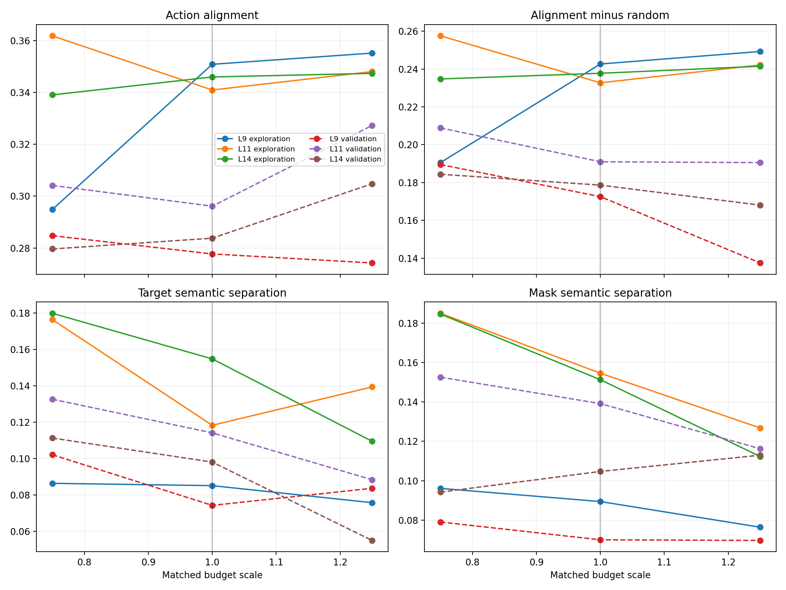

# Prompt-action layer budget robustness

## Protocol

L9, L11, and L14 are evaluated on the same 90 cached states using budget scales 0.75, 1.0, and 1.25. No image boxes or closed-loop rollouts are used.

Technical replay audit: maximum clean-action-logit difference = `0`.

## Aggregate results

| Split | Layer | Scale | Mean tokens | Action alignment | Minus random | Semantic separation | Mask separation |
|---|---:|---:|---:|---:|---:|---:|---:|
| exploration | L9 | 0.75 | 26.67 | 0.2949 | 0.1905 | 0.0864 | 0.0961 |
| exploration | L9 | 1.00 | 35.62 | 0.3509 | 0.2426 | 0.0851 | 0.0894 |
| exploration | L9 | 1.25 | 44.57 | 0.3552 | 0.2493 | 0.0757 | 0.0764 |
| exploration | L11 | 0.75 | 26.67 | 0.3619 | 0.2575 | 0.1763 | 0.1850 |
| exploration | L11 | 1.00 | 35.62 | 0.3410 | 0.2327 | 0.1182 | 0.1546 |
| exploration | L11 | 1.25 | 44.57 | 0.3481 | 0.2422 | 0.1393 | 0.1268 |
| exploration | L14 | 0.75 | 26.67 | 0.3391 | 0.2348 | 0.1798 | 0.1846 |
| exploration | L14 | 1.00 | 35.62 | 0.3460 | 0.2378 | 0.1547 | 0.1513 |
| exploration | L14 | 1.25 | 44.57 | 0.3474 | 0.2415 | 0.1095 | 0.1123 |
| validation | L9 | 0.75 | 23.47 | 0.2847 | 0.1895 | 0.1021 | 0.0790 |
| validation | L9 | 1.00 | 31.27 | 0.2777 | 0.1725 | 0.0743 | 0.0700 |
| validation | L9 | 1.25 | 39.07 | 0.2742 | 0.1375 | 0.0836 | 0.0697 |
| validation | L11 | 0.75 | 23.47 | 0.3041 | 0.2089 | 0.1326 | 0.1526 |
| validation | L11 | 1.00 | 31.27 | 0.2961 | 0.1910 | 0.1141 | 0.1392 |
| validation | L11 | 1.25 | 39.07 | 0.3273 | 0.1905 | 0.0883 | 0.1162 |
| validation | L14 | 0.75 | 23.47 | 0.2796 | 0.1844 | 0.1112 | 0.0942 |
| validation | L14 | 1.00 | 31.27 | 0.2838 | 0.1786 | 0.0980 | 0.1047 |
| validation | L14 | 1.25 | 39.07 | 0.3048 | 0.1680 | 0.0550 | 0.1130 |

## Boundary

These are offline action-level proxies. They test whether the layer shortlist depends on the exact matched budget, but they cannot determine closed-loop success.
