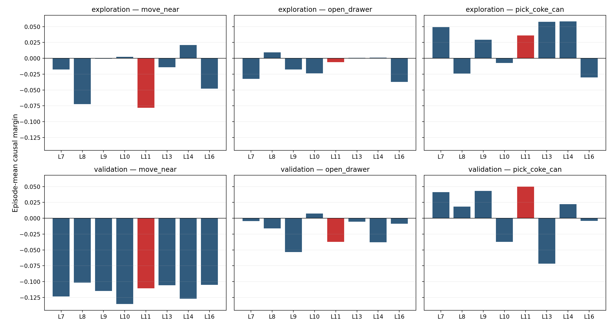
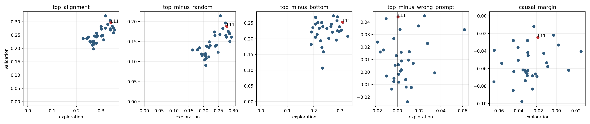

# Expanded action-level layer robustness audit

## Direct conclusions

- Robust mean-rank top 8: L9 (4.6), L14 (5.2), L11 (5.8), L7 (6.6), L6 (7.2), L8 (8.7), L10 (8.8), L1 (9.1).
- L11 robust mean rank: 5.8/32; worst rank across split/metrics: 21/32.
- No validation layer has positive aggregate causal margin against all three controls.
- Therefore the strict causal-margin criterion does not identify a stable winner.

## Split rank correlations

| Metric | Spearman rho | p |
|---|---:|---:|
| top_alignment | 0.765 | 3.49e-07 |
| top_minus_random | 0.765 | 3.49e-07 |
| top_minus_bottom | 0.257 | 0.156 |
| top_minus_wrong_prompt | 0.018 | 0.924 |
| causal_margin | 0.268 | 0.138 |

## L11 taskwise

| Split | Task | Top alignment | Margin | Top-vs-wrong | Mask Jaccard |
|---|---|---:|---:|---:|---:|
| exploration | move_near | 0.3567 | -0.0780 | -0.0559 | 0.786 |
| exploration | open_drawer | 0.3225 | -0.0059 | +0.0179 | 0.775 |
| exploration | pick_coke_can | 0.3442 | +0.0359 | +0.0463 | 0.648 |
| validation | move_near | 0.2481 | -0.1108 | -0.0303 | 0.807 |
| validation | open_drawer | 0.2510 | -0.0372 | +0.0037 | 0.723 |
| validation | pick_coke_can | 0.3660 | +0.0500 | +0.1302 | 0.694 |

## Interpretation

- L11 is usually strong on raw action alignment and against Random/Bottom controls.
- Its strict margin is weakened because the alternate-Prompt mask often produces a similarly aligned action residual.
- This means the current metric verifies Prompt-sensitive action mediation, but does not uniquely validate the original-Prompt Top-m mask.
- L11 remains the best tested closed-loop single layer only because other single layers have not yet received closed-loop evaluation.

