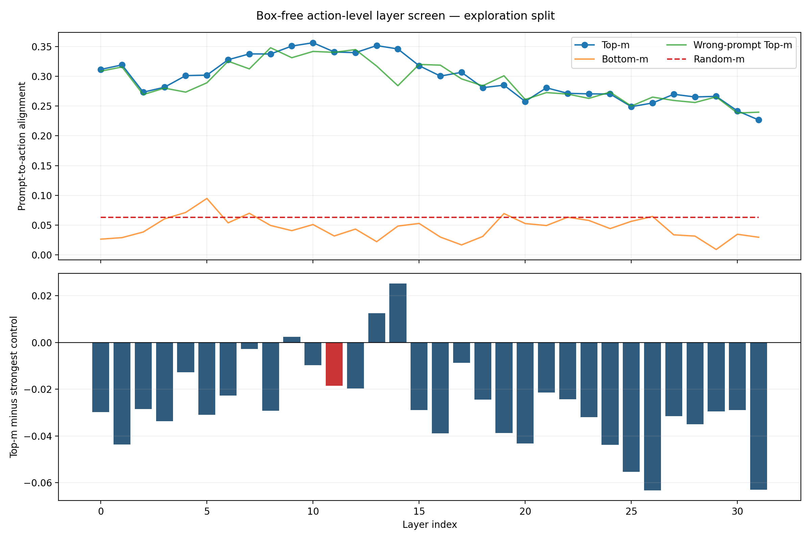
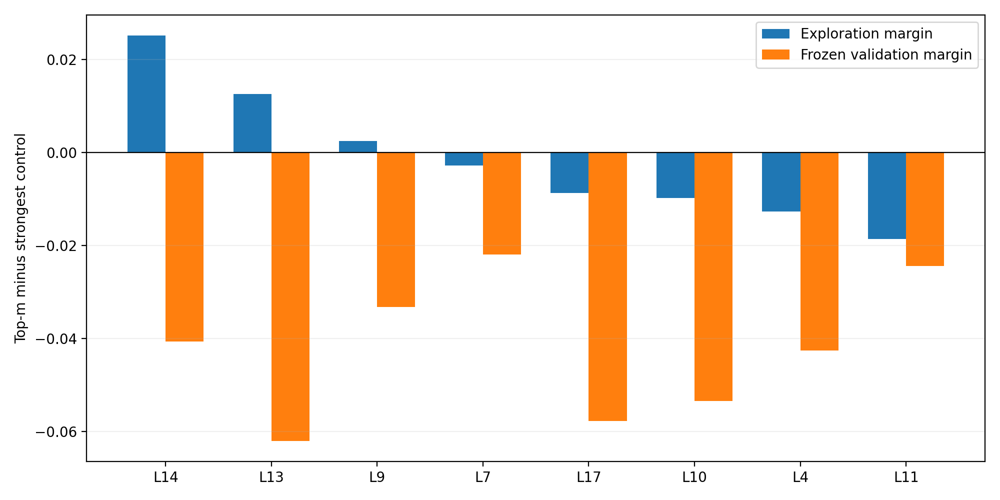

# Prompt-to-action layer causal screen

This audit uses no target boxes. It ranks layers by whether reconstructing their Prompt-Top-m tokens produces an action-logit residual aligned with the residual caused by changing the Prompt target.

## Protocol

- 90 same-image target-switch states, aggregated into episodes before layer ranking.
- Primary metric: mean per-action-dimension cosine between intervention residual and target-Prompt residual.
- Causal margin: Top-m alignment minus the strongest of Random-m, Bottom-m, and wrong-Prompt Top-m.
- Manual target boxes are not read or used.

## Exploration top 8

| Rank | Layer | Top alignment | Causal margin | 95% CI | Validation alignment | Validation margin |
|---:|---:|---:|---:|---:|---:|---:|
| 1 | L14 | 0.3460 | +0.0252 | [-0.0107, +0.0648] | 0.2838 | -0.0407 |
| 2 | L13 | 0.3517 | +0.0125 | [-0.0128, +0.0392] | 0.2587 | -0.0620 |
| 3 | L9 | 0.3509 | +0.0024 | [-0.0247, +0.0320] | 0.2777 | -0.0332 |
| 4 | L7 | 0.3377 | -0.0028 | [-0.0359, +0.0300] | 0.2734 | -0.0220 |
| 5 | L17 | 0.3067 | -0.0087 | [-0.0353, +0.0150] | 0.2488 | -0.0577 |
| 6 | L10 | 0.3565 | -0.0097 | [-0.0281, +0.0074] | 0.2693 | -0.0534 |
| 7 | L4 | 0.3012 | -0.0127 | [-0.0465, +0.0236] | 0.2728 | -0.0426 |
| 8 | L11 | 0.3410 | -0.0186 | [-0.0610, +0.0194] | 0.2961 | -0.0244 |

## L11

- Exploration rank: 8/32.
- Exploration Top alignment / causal margin: 0.3410 / -0.0186.
- Frozen validation Top alignment / causal margin: 0.2961 / -0.0244.

## Figures

## Boundary

- This is an action-level offline causal proxy, not closed-loop success.
- The target-switch sample is small; only frozen validation consistency should justify a closed-loop shortlist.
