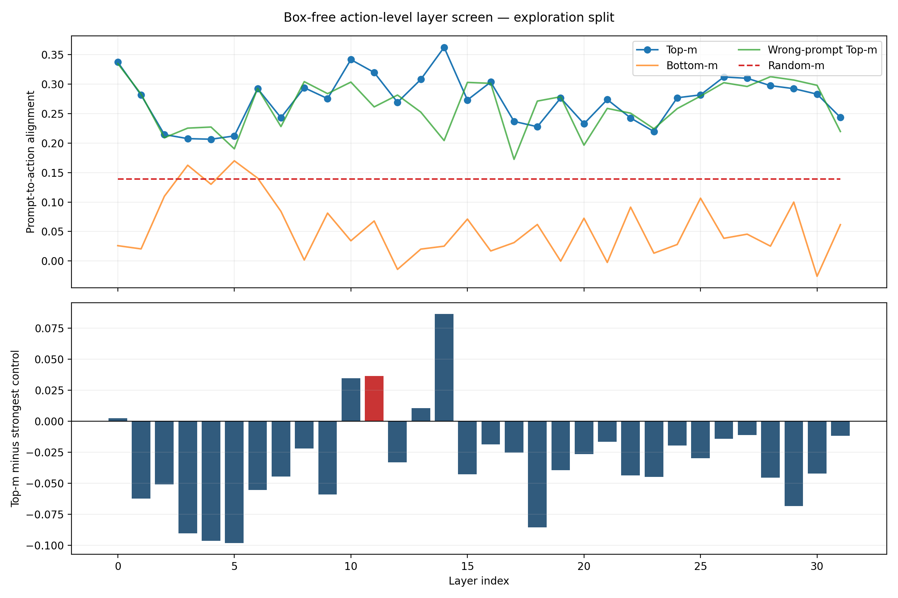
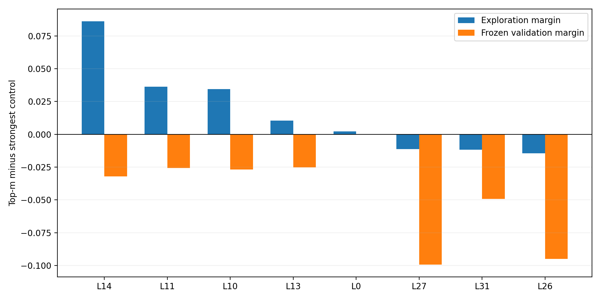

# Prompt-to-action layer causal screen

This audit uses no target boxes. It ranks layers by whether reconstructing their Prompt-Top-m tokens produces an action-logit residual aligned with the residual caused by changing the Prompt target.

## Protocol

- 9 same-image target-switch states: 6 exploration, 3 frozen validation.
- Primary metric: mean per-action-dimension cosine between intervention residual and target-Prompt residual.
- Causal margin: Top-m alignment minus the strongest of Random-m, Bottom-m, and wrong-Prompt Top-m.
- Manual target boxes are not read or used.

## Exploration top 8

| Rank | Layer | Top alignment | Causal margin | Validation alignment | Validation margin |
|---:|---:|---:|---:|---:|---:|
| 1 | L14 | 0.3623 | +0.0863 | 0.2870 | -0.0320 |
| 2 | L11 | 0.3196 | +0.0363 | 0.2551 | -0.0257 |
| 3 | L10 | 0.3415 | +0.0346 | 0.3090 | -0.0268 |
| 4 | L13 | 0.3079 | +0.0105 | 0.3195 | -0.0252 |
| 5 | L0 | 0.3372 | +0.0023 | 0.3429 | +0.0000 |
| 6 | L27 | 0.3098 | -0.0112 | 0.2140 | -0.0994 |
| 7 | L31 | 0.2435 | -0.0118 | 0.2317 | -0.0492 |
| 8 | L26 | 0.3121 | -0.0144 | 0.2008 | -0.0951 |

## L11

- Exploration rank: 2/32.
- Exploration Top alignment / causal margin: 0.3196 / +0.0363.
- Frozen validation Top alignment / causal margin: 0.2551 / -0.0257.

## Figures

## Boundary

- This is an action-level offline causal proxy, not closed-loop success.
- The target-switch sample is small; only frozen validation consistency should justify a closed-loop shortlist.
