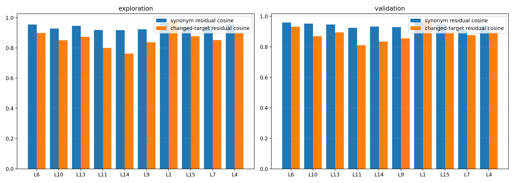

# Box-free action-level semantic consistency audit

## Question

Does a layer produce similar intervention effects for paraphrases, but different effects when the task target changes? No image boxes are used.

## Robust ranking

| Rank | Layer | Mean rank | Worst rank |
|---:|---:|---:|---:|
| 1 | L6 | 7.75 | 13 |
| 2 | L10 | 8.38 | 25 |
| 3 | L13 | 8.62 | 13 |
| 4 | L11 | 9.38 | 28 |
| 5 | L14 | 9.38 | 30 |
| 6 | L9 | 9.88 | 26 |
| 7 | L1 | 10.75 | 32 |
| 8 | L15 | 10.88 | 18 |
| 9 | L7 | 11.38 | 30 |
| 10 | L4 | 12.00 | 19 |
| 11 | L12 | 12.12 | 21 |
| 12 | L8 | 12.62 | 29 |

## L11

| Split | Action alignment | Synonym cosine | Target cosine | Separation |
|---|---:|---:|---:|---:|
| exploration | 0.3410 | 0.9184 | 0.8002 | +0.1182 |
| validation | 0.2961 | 0.9244 | 0.8103 | +0.1141 |

## Split correlations

| Metric | rho | p |
|---|---:|---:|
| top_alignment | 0.765 | 3.49e-07 |
| top_minus_random | 0.765 | 3.49e-07 |
| synonym_residual_cosine | 0.589 | 0.000394 |
| semantic_separation | 0.781 | 1.32e-07 |

## Boundary

This remains an offline action-level proxy. It can shortlist single layers but cannot replace closed-loop success evaluation.
