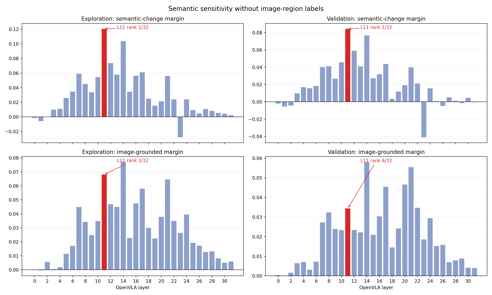

# Box-free semantic layer scan

## Definition

A semantic layer should remain stable for paraphrases and irrelevant wording, but change when the task target or relation changes. No token is mapped back to an image region.

Attention replay maximum absolute difference: `0`.

## Top layers

| Split | Criterion | Top five | L11 |
|---|---|---|---|
| exploration | semantic margin | L11 (+0.1205), L14 (+0.1036), L12 (+0.0736), L17 (+0.0611), L7 (+0.0590) | +0.1205, rank 1/32 |
| exploration | grounded margin | L14 (+0.0771), L11 (+0.0680), L21 (+0.0645), L17 (+0.0580), L16 (+0.0475) | +0.0680, rank 2/32 |
| validation | semantic margin | L11 (+0.0843), L14 (+0.0767), L12 (+0.0590), L10 (+0.0457), L17 (+0.0437) | +0.0843, rank 1/32 |
| validation | grounded margin | L14 (+0.0579), L21 (+0.0554), L20 (+0.0465), L17 (+0.0454), L22 (+0.0347) | +0.0343, rank 6/32 |

## Split stability

| Metric | Spearman rho | p |
|---|---:|---:|
| real_semantic_margin | 0.953 | 4.08e-17 |
| grounded_semantic_margin | 0.912 | 4.08e-13 |

## Boundary

This scan selects layers by semantic sensitivity, not by action effect or closed-loop success. A small closed-loop comparison is still needed after shortlisting.
